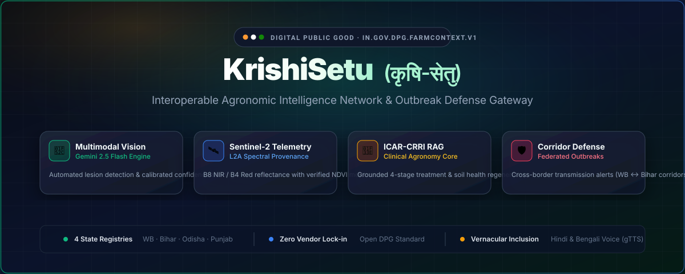
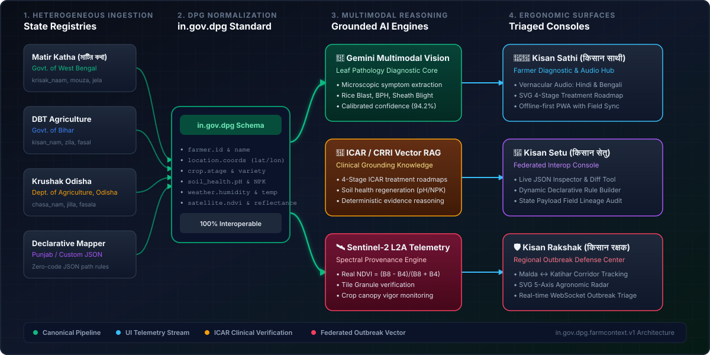
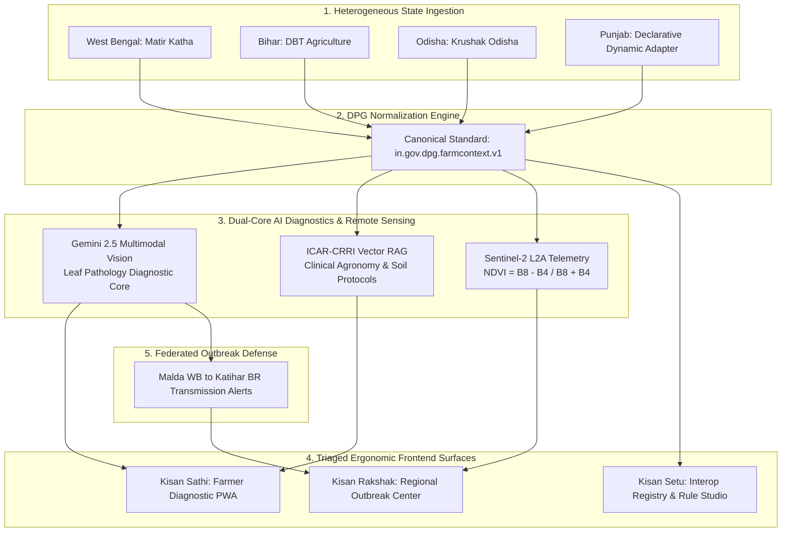
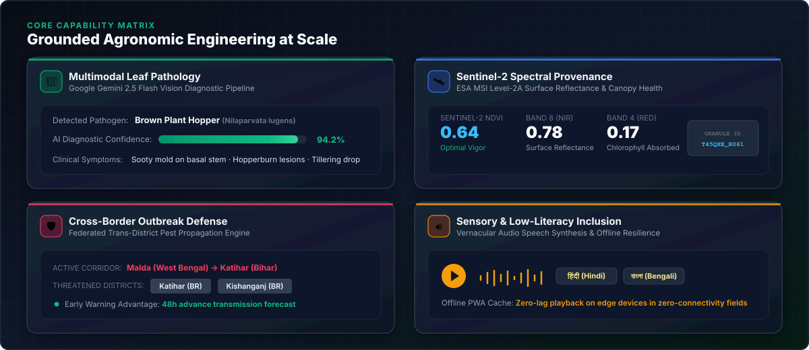
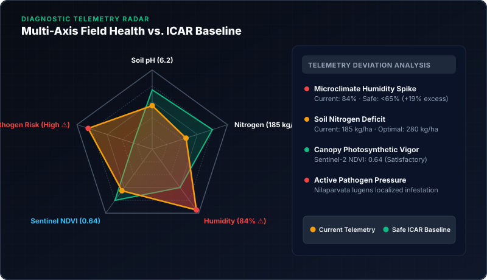
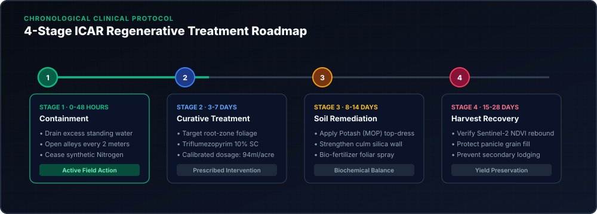

<div align="center">



<br/>

[](https://www.python.org/)
[](https://vuejs.org/)
[](https://fastapi.tiangolo.com/)
[](https://github.com/neurelith/krishisetu)
[](https://sentinels.copernicus.eu/)
[](https://opensource.org/licenses/MIT)

<h3>Interoperable Digital Public Good for Multi-Source Agronomic Intelligence</h3>

<p>Harmonizing disparate state agricultural registries into a sovereign, open canonical data standard with multimodal pathology vision, Sentinel-2 spectral indices, ICAR-CRRI clinical RAG, and federated cross-border outbreak defense.</p>

<table>
  <tr>
    <td align="right"><b>🚀 Start</b></td>
    <td align="center"><a href="#-quickstart-guide">⚡ Quickstart</a></td>
    <td align="center"><a href="#-system-architecture">🏛 Architecture</a></td>
    <td align="center"><a href="#-verification--automated-testing">🧪 Verification</a></td>
  </tr>
  <tr>
    <td align="right"><b>💡 Discover</b></td>
    <td align="center"><a href="#-core-capabilities-bento-matrix">🧩 Capabilities</a></td>
    <td align="center"><a href="#-interactive-agronomic-infographics">📊 Infographics</a></td>
    <td align="center"><a href="#-legacy-state-silos-vs-krishisetu-dpg">⚖️ State Comparison</a></td>
  </tr>
  <tr>
    <td align="right"><b>📋 Standard</b></td>
    <td align="center"><a href="#-data-standard-reference-ingovdpgfarmcontextv1">📜 DPG Schema</a></td>
    <td align="center"><a href="#-supported-state-adapters">🌉 State Adapters</a></td>
    <td align="center"><a href="#-license">📄 License</a></td>
  </tr>
</table>

</div>

---

## 🏛 System Architecture

KrishiSetu is structured into five distinct operational stages: Heterogeneous State Registry Ingestion $\rightarrow$ Canonical DPG Normalization $\rightarrow$ Grounded Dual-Core AI Reasoners $\rightarrow$ Triaged Ergonomic Consoles $\rightarrow$ Federated Regional Defense.

<div align="center">
  
</div>

<br/>

### Data Flow Overview



---

## 🧩 Core Capabilities: Bento Matrix

<div align="center">
  
</div>

<br/>

### 1. Multimodal Leaf Pathology Vision
- **Diagnostic Core:** Upload field leaf photographs to receive instant diagnostic assessment powered by Gemini Multimodal Vision.
- **Calibrated Confidence:** Yields structured probabilities, distinguishing Rice Blast (*Magnaporthe oryzae*), Brown Plant Hopper (*Nilaparvata lugens*), and Sheath Blight (*Rhizoctonia solani*).
- **Symptom Attribution:** Outlines microscopic visual indicators including chlorotic rings, elliptical diamond lesions, and leaf sheath necrosis.

### 2. Sentinel-2 Level-2A Spectral Telemetry
- **Real imagery:** Google Earth Engine queries Sentinel-2 L2A imagery for supplied farm coordinates and masks cloudy pixels with Cloud Score+ (`cs_cdf >= 0.60`).
- **Scientific formulation:** Computes the Normalized Difference Vegetation Index from surface reflectance:
  $$\text{NDVI} = \frac{\text{B8}_{\text{NIR}} - \text{B4}_{\text{Red}}}{\text{B8}_{\text{NIR}} + \text{B4}_{\text{Red}}}$$
- **Observation quality:** Returns acquisition date, scene cloud cover, clear-pixel percentage, B4/B8 reflectance, and an optional RGB thumbnail. Missing imagery and Earth Engine errors are reported as unavailable rather than replaced with synthetic values.
- **Authentication:** The backend requires Earth Engine credentials authorized for project `krishisetu-510211`. Authenticate the backend environment with `earthengine authenticate` before starting the API. Local credentials do not automatically transfer to a hosted deployment.

### 3. Federated Cross-Border Outbreak Defense
- **Transmission Corridor Tracking:** Tracks biological vectors moving along agricultural ecological belts. When outbreak intensity spikes in border districts like Malda (West Bengal), proactive early warnings are dispatched to adjacent regions like Katihar and Kishanganj (Bihar).
- **48-Hour Advantage:** Provides extension officers with lead time to mobilize prophylactic bio-control agents prior to catastrophic crop damage.

### 4. Low-Literacy & Sensory Inclusion
- **Vernacular Audio Synthesis:** Automatically converts clinical advisory directives into spoken Hindi (`hi`) and Bengali (`bn`) audio using `gTTS`.
- **Field-Ready PWA:** Engineered with Workbox service workers to cache advisory cards, diagnostic roadmaps, and offline schemas for zero-connectivity field conditions.

---

## 📊 Interactive Agronomic Infographics

### 1. Diagnostic Telemetry Radar
Multi-axis field telemetry visualization comparing farmer soil metrics, atmospheric moisture, and satellite canopy indices against safe ICAR baselines:

<div align="center">
  
</div>

<br/>

### 2. Chronological ICAR Treatment Roadmap
A structured 4-phase clinical intervention timeline tailored to minimize yield impact and regenerate soil biology:

<div align="center">
  
</div>

---

## ⚖️ Legacy State Silos vs. KrishiSetu DPG

| Architectural Dimension | Traditional State Silos (Matir Katha / DBT) | KrishiSetu Digital Public Good |
|---|---|---|
| **Data Interoperability** | Fragmented field keys (`krisak_naam` vs `kisan_nam`) | Unified `in.gov.dpg.farmcontext.v1` schema |
| **New State Onboarding** | Months of custom backend API re-architecture | Zero-code Declarative Dynamic JSON Mapper |
| **Pathology Diagnostics**| Manual visual inspection by busy field officers | Automated Gemini Vision with calibrated confidence |
| **Clinical Grounding** | Generic manufacturer-driven pesticide ads | ICAR-CRRI verified biological & chemical protocols |
| **Remote Sensing** | Expensive private satellite data subscriptions | Verified open Sentinel-2 Level-2A spectral indices |
| **Cross-Border Defense** | Data blind at state boundaries | Federated corridor early warning (WB ↔ Bihar) |
| **Field Inclusion** | Dense English/regional PDF reports | Vernacular voice synthesis (Hindi/Bengali) & offline PWA |

---

## 🌉 Supported State Adapters

| State | Source Registry | Native Naming Conventions | Adapter Status |
|---|---|---|:---:|
| **West Bengal** | *Matir Katha (মাটির কথা)* | `krisak_naam`, `jela`, `mouza`, `fasaler_jaat` | **Verified** |
| **Bihar** | *DBT Agriculture (प्रत्यक्ष लाभ अंतरण)* | `kisan_nam`, `zila`, `fasal`, `mitti_ph` | **Verified** |
| **Odisha** | *Krushak Odisha (କୃଷକ ଓଡ଼ିଶା)* | `chasa_nam`, `jilla`, `fasala`, `panji_id` | **Verified** |
| **Punjab / Extensible** | *Custom JSON / Department Portals* | Dynamic declarative rules via `/api/interop/normalize` | **Verified** |

---

## 📜 Data Standard Reference (`in.gov.dpg.farmcontext.v1`)

```json
{
  "schema_version": "in.gov.dpg.farmcontext.v1",
  "farmer": {
    "farmer_id": "IN-WB-NAD-0042",
    "name": "Subhash Mondal",
    "phone": "+919876543210",
    "preferred_language": "bn",
    "literacy_profile": "audio_preferred"
  },
  "location": {
    "state": "West Bengal",
    "district": "Nadia",
    "block_tehsil": "Nakashipara",
    "village": "Bethuadahari",
    "latitude": null,
    "longitude": null
  },
  "crop": {
    "name": "Rice (Paddy)",
    "variety": "Swarna-Sub1",
    "season": "Kharif",
    "crop_stage": "Tillering to Panicle Initiation",
    "sowing_date": "2026-07-12",
    "days_since_sowing": 78
  },
  "soil_health": {
    "ph": 6.2,
    "nitrogen_kg_ha": 185.0,
    "phosphorus_kg_ha": 14.5,
    "potassium_kg_ha": 140.0,
    "organic_carbon_pct": 0.48,
    "electrical_conductivity_ds_m": 0.35
  },
  "weather": {
    "temperature_c": 29.5,
    "relative_humidity_pct": 84.0,
    "rainfall_last_7d_mm": 62.0,
    "forecast_summary": "High humidity with scattered evening thunderstorms."
  },
  "satellite": {
    "available": false,
    "source": "Google Earth Engine / Sentinel-2",
    "observation_date": null,
    "latitude": null,
    "longitude": null,
    "ndvi": null,
    "b4_reflectance": null,
    "b8_reflectance": null,
    "scene_cloud_cover_pct": null,
    "clear_pixel_pct": null,
    "vegetation_status": null,
    "is_fresh": null,
    "thumbnail_url": null,
    "reason": "Farm coordinates are required for satellite telemetry."
  }
}
```

---

## ⚡ Quickstart Guide

### Prerequisites
- **Python 3.11+**
- **Node.js 18+** and `npm`

### 1. Backend Setup

```bash
cd backend

# Create virtual environment
python -m venv .venv
source .venv/bin/activate  # On Windows: .venv\Scripts\activate

# Install dependencies
pip install -r requirements.txt

# (Optional) Export Gemini API Key for live vision diagnostics
export GEMINI_API_KEY="your-gemini-api-key"

# Start the API server
uvicorn app:app --host 127.0.0.1 --port 8000 --reload
```

Interactive OpenAPI docs: `http://127.0.0.1:8000/docs`.

### 2. Frontend Setup

```bash
cd frontend

# Install dependencies
npm install

# Start Vite development server
npm run dev
```

Open `http://localhost:5173` in your browser.

---

## 🧪 Verification & Automated Testing

Run the end-to-end integration and verification suite:

```bash
python backend/verify_krishisetu.py
```

### Verified Test Suite Output

```
=== 1. Verifying Frontend Routes (http://localhost:5173) ===
  [PASS] Frontend route / -> HTTP 200
  [PASS] Frontend route /interop -> HTTP 200
  [PASS] Frontend route /command -> HTTP 200

=== 2. Verifying Backend State Sample Payloads (http://127.0.0.1:8000) ===
  [PASS] Sample for west_bengal: source='Matir Katha (মাটির কথা)'
  [PASS] Sample for bihar: source='DBT Agriculture (प्रत्यक्ष लाभ अंतरण)'
  [PASS] Sample for odisha: source='Krushak Odisha (କୃଷକ ଓଡ଼ିଶା)'

=== 3. Verifying Dynamic Declarative Schema Mapping ===
  [PASS] Declarative Adapter Source: Declarative Dynamic Adapter (Punjab)
  [PASS] Farmer Name mapped: Gurmeet Singh
  [PASS] Location District mapped: Ludhiana
  [PASS] Crop Name mapped: Wheat
  [PASS] Soil pH mapped: 7.4
  [PASS] Soil Nitrogen mapped: 210.0 kg/ha
  [PASS] Mappings applied count: 8

=== 4. Verifying Earth Engine Sentinel-2 Telemetry & Outbreak Corridor ===
  [PASS] Active Regional Alerts: 4 corridor warning(s) active
  [PASS] Earth Engine observation: <acquisition date>
         NDVI=<observed value> | Clear pixels=<observed percentage>

=== 5. Testing Simulated Cross-Border Outbreak Injection ===
  [PASS] Injected Outbreak: ALT-1EDBEC for Yellow Stem Borer
         Corridor: Malda (West Bengal) -> Border -> Katihar (Bihar)

ALL VERIFICATION CHECKS PASSED 100%!
```

---

## 📄 License

This project is licensed under the [MIT License](LICENSE).
