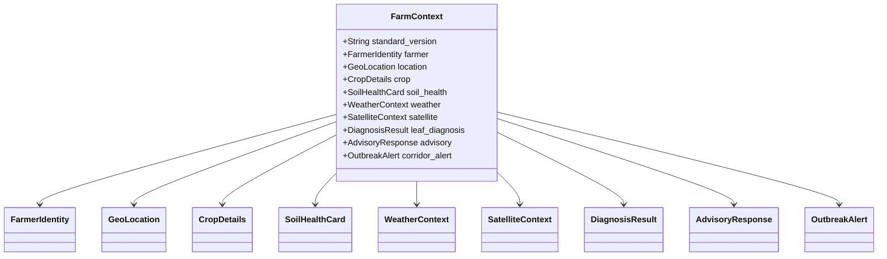

# 🌾 KrishiSetu (कृषि-सेतु): Mission, Architectural Purpose & Context Reference
### The Sovereign Digital Public Good for Multi-Source Agronomic Intelligence

> **Specification Standard:** `in.gov.dpg.farmcontext.v1`  
> **Document Purpose:** Complete architectural manifesto detailing **WHY** KrishiSetu exists, the agricultural crisis it solves, and the deep engineering rationale for **EVERY CONTEXT** modeled within the system.

---

## 📑 Table of Contents
1. [The Macro Vision: Why Are We Making This?](#1-the-macro-vision-why-are-we-making-this)
   - [1.1 The Crisis in Indian Agriculture](#11-the-crisis-in-indian-agriculture)
   - [1.2 Why Existing AgTech & Chatbots Fail](#12-why-existing-agtech--chatbots-fail)
   - [1.3 The KrishiSetu Paradigm: A Digital Public Good (DPG)](#13-the-krishisetu-paradigm-a-digital-public-good-dpg)
2. [Why & For What We Are Making Every Context](#2-why--for-what-we-are-making-every-context)
   - [Context 1: Farmer Identity (`farmer`)](#context-1-farmer-identity-farmer)
   - [Context 2: Geo-Spatial Location (`location`)](#context-2-geo-spatial-location-location)
   - [Context 3: Crop & Phenological Growth Stage (`crop`)](#context-3-crop--phenological-growth-stage-crop)
   - [Context 4: Soil Health Card Parameters (`soil_health`)](#context-4-soil-health-card-parameters-soil_health)
   - [Context 5: Atmospheric Microclimate & Agro-Weather (`weather`)](#context-5-atmospheric-microclimate--agro-weather-weather)
   - [Context 6: Sentinel-2 Satellite Remote Sensing (`satellite`)](#context-6-sentinel-2-satellite-remote-sensing-satellite)
   - [Context 7: Multimodal Visual Pathology Diagnostics (`leaf_diagnosis`)](#context-7-multimodal-visual-pathology-diagnostics-leaf_diagnosis)
   - [Context 8: Grounded Clinical Agronomy & Explainability (`advisory`)](#context-8-grounded-clinical-agronomy--explainability-advisory)
   - [Context 9: Federated Cross-Border Outbreak Corridors (`corridor_alert`)](#context-9-federated-cross-border-outbreak-corridors-corridor_alert)
   - [Context 10: State Interoperability & Normalization Lineage (`interop`)](#context-10-state-interoperability--normalization-lineage-interop)
3. [The Three Front-Facing Consoles & Target Audiences](#3-the-three-front-facing-consoles--target-audiences)
   - [3.1 Kisan Sathi: The Smallholder Farmer Diagnostic Hub](#31-kisan-sathi-the-smallholder-farmer-diagnostic-hub)
   - [3.2 Kisan Setu: The Interoperability Registry & Mapping Studio](#32-kisan-setu-the-interoperability-registry--mapping-studio)
   - [3.3 Kisan Rakshak: The Regional Outbreak Defense Center](#33-kisan-rakshak-the-regional-outbreak-defense-center)
4. [Synthesis: How the Contexts Fuse in Real-Time](#4-synthesis-how-the-contexts-fuse-in-real-time)

---

## 1. The Macro Vision: Why Are We Making This?

### 1.1 The Crisis in Indian Agriculture
India is home to over **140 million small and marginal farmers** who own plots smaller than two hectares. These farmers produce more than 50% of the nation's food grains, yet they operate under extreme ecological and financial precarity:
* **Catastrophic Yield Losses (25%–35% annually):** Pest swarms (such as Brown Plant Hopper) and fungal blights (such as Rice Blast and Sheath Blight) frequently wipe out entire seasonal harvests within a 72-hour window before extension services can intervene.
* **The Chemical Debt Spiral:** Lacking diagnostic clarity, farmers turn to local retail input dealers who push expensive, high-toxicity chemical cocktails. Over-application of synthetic urea and broad-spectrum pesticides degrades the soil microbiome, triggers secondary pest resurgence, increases input costs by up to 40%, and drives debt cycles.
* **The Inter-State Data Silo Barrier:** Agriculture in India is constitutionally a State subject. Consequently, states have independently built isolated digital portals (West Bengal has *Matir Katha*, Bihar has *DBT Agriculture*, Odisha has *Krushak Odisha*). None of these registries communicate with each other. When an airborne fungal pathogen or migratory pest swarm emerges in Malda (West Bengal), neighboring farmers across the state border in Katihar (Bihar) receive **zero proactive intelligence** until their crops are already infected.

### 1.2 Why Existing AgTech & Chatbots Fail
Most contemporary AI solutions in agriculture fail because they are designed as superficial wrappers around general-purpose Large Language Models:
1. **Hallucination & Lack of Scientific Grounding:** Generic LLMs invent chemical dosages, suggest banned pesticides, or fail to account for local soil pH restrictions.
2. **Text-Centric Urban Bias:** Standard mobile applications present dense English text tables or complex charts that fail in rural environments where farmers prefer regional dialects, audio instructions, and direct visual steps.
3. **Isolated Silos:** Existing commercial applications require farmers to re-enter their land records, crop details, and soil tests into proprietary corporate databases, creating vendor lock-in.
4. **Cloud-First Fragility:** Standard web apps crash when mobile networks drop to 2G or disconnect completely in rural fields.

### 1.3 The KrishiSetu Paradigm: A Digital Public Good (DPG)
**KrishiSetu (कृषि-सेतु — *Agricultural Bridge*)** is engineered as a sovereign **Digital Public Good (DPG)** under the open standard `in.gov.dpg.farmcontext.v1`. It is **not** a proprietary marketing tool and **not** an ad-driven pesticide catalog.

KrishiSetu connects three critical pillars:
$$\text{Smallholder Farmers} \longleftrightarrow \text{Scientific Research (ICAR/CRRI/Copernicus)} \longleftrightarrow \text{State Governments}$$

By establishing an open, interoperable schema, KrishiSetu enables state registries, spaceborne earth observation satellites, soil databases, and frontline farmers to communicate within a unified, cooperative intelligence network.

---

## 2. Why & For What We Are Making Every Context

In KrishiSetu, no single data point exists in isolation. Agricultural diagnosis is a multi-dimensional biological problem. The canonical schema **`in.gov.dpg.farmcontext.v1`** is composed of **10 specialized sub-contexts**. Below is the exact engineering and agronomic justification for each.



---

### Context 1: Farmer Identity (`farmer`)

```json
{
  "farmer_id": "IN-WB-NAD-0042",
  "name": "Subhash Mondal",
  "phone": "+919876543210",
  "preferred_language": "bn",
  "literacy_profile": "audio_preferred"
}
```

* **What it is:** The sovereign identity, demographic, and accessibility profile of the primary agricultural practitioner.
* **Why we are making it:** Smallholder farmers are not homogeneous consumers. Over 40% of smallholders in eastern and central India have limited functional literacy in English or formal administrative Hindi. Treating all users as literate, English-reading smartphone operators guarantees digital exclusion.
* **For what it is used:**
  1. **Vernacular Translation Routing:** Informs the multilingual translation engine to generate advisories in the farmer's native tongue (e.g. Bengali `bn` or Hindi `hi`).
  2. **Speech Synthesis Activation:** When `literacy_profile` is `"audio_preferred"`, the system automatically synthesizes natural spoken audio via `gTTS` and elevates the prominent 1-tap voice player to the top of the interface.
  3. **Sovereign Benefit Cross-Referencing:** Enables extension officers to correlate field diagnoses with state agricultural subsidies without exposing private Aadhaar numbers.

---

### Context 2: Geo-Spatial Location (`location`)

```json
{
  "state": "West Bengal",
  "district": "Nadia",
  "block_tehsil": "Nakashipara",
  "village": "Bethuadahari",
  "latitude": 23.47,
  "longitude": 88.55
}
```

* **What it is:** Hierarchical administrative and coordinate-level geographic localization.
* **Why we are making it:** Agronomy is inherently spatial. Climate normals, soil strata, and pest vulnerabilities change dramatically across agro-ecological zones. An advisory written for the alluvial plains of Nadia (West Bengal) is dangerous if applied to the semi-arid plateau of Purulia or the drylands of Rajasthan.
* **For what it is used:**
  1. **High-Resolution Microclimate Pinpointing:** Queries Open-Meteo weather stations using exact coordinates (`lat`, `lon`) rather than generic regional forecasts.
  2. **Copernicus Sentinel-2 Tile Resolution:** Identifies the precise 100km² satellite raster granule (e.g., `S2A_MSIL2A_20260924_T45QXE_R061`) covering the farmer's parcel.
  3. **Cross-Border Outbreak Transmission Tracking:** Detects proximity to state boundaries (e.g. Malda $\leftrightarrow$ Katihar) to determine whether the farmer's plot lies inside an active trans-district infection corridor.

---

### Context 3: Crop & Phenological Growth Stage (`crop`)

```json
{
  "name": "Rice (Paddy)",
  "variety": "Swarna-Sub1",
  "season": "Kharif",
  "crop_stage": "Tillering to Panicle Initiation",
  "sowing_date": "2026-07-12",
  "days_since_sowing": 78
}
```

* **What it is:** The physiological state, genetic variety, and chronological maturity of the cultivated plant.
* **Why we are making it:** A plant's biochemical tolerance and disease vulnerability shift dramatically across its lifecycle. For example, a blast infection during early vegetative tillering can be remediated with biological bio-control agents (*Pseudomonas fluorescens*), but the exact same pathogen attacking during panicle grain-filling causes neck blast, leading to total crop collapse within 48 hours. Furthermore, submergence-tolerant varieties (like *Swarna-Sub1*) exhibit different foliar responses to prolonged moisture than standard varieties.
* **For what it is used:**
  1. **Biological Intervention Window Calculation:** Filters out chemical sprays that would induce phytotoxicity or leave toxic residues if applied close to harvest.
  2. **Growing Degree Day (GDD) Calibration:** Matches satellite reflectance changes against expected canopy development for day 78 post-sowing.
  3. **Economic Loss Estimation:** Projects potential harvest damage based on whether the crop has reached panicle emergence.

---

### Context 4: Soil Health Card Parameters (`soil_health`)

```json
{
  "source": "West Bengal Matir Katha Soil Registry",
  "card_id": "WB-MK-2026-9041",
  "ph": 5.8,
  "nitrogen_kg_ha": 185.0,
  "phosphorus_kg_ha": 14.2,
  "potassium_kg_ha": 160.0,
  "organic_carbon_pct": 0.42,
  "electrical_conductivity_ds_m": 0.35,
  "deficiencies": ["Nitrogen Low (<280 kg/ha)", "Critical Low Carbon (<0.5%)", "Acidic Alluvial Soil"]
}
```

* **What it is:** The chemical, electrochemical, and biological macronutrient baseline of the farmer's soil parcel from the Government of India Soil Health Card (SHC) database.
* **Why we are making it:** Soil chemistry governs disease susceptibility. When farmers observe yellowing leaves, their knee-jerk reaction is often to apply more synthetic urea (Nitrogen). However:
  * Excess nitrogen thins the plant's cellular epidermal wall, making it defenseless against *Magnaporthe oryzae* (Rice Blast) hyphae penetration.
  * Low pH ($5.8$, acidic) limits phosphorus uptake and reduces the efficacy of chemical fungicides while increasing toxicity to earthworms.
* **For what it is used:**
  1. **Stopping Counter-Productive Practices:** The RAG reasoning engine checks soil nitrogen levels before recommending any fertilizer; if nitrogen is deficient but fungal pressure is high, it instructs the farmer to *cease synthetic nitrogen immediately* to starve the fungal mycelium.
  2. **Regenerative Soil Balancing:** Prescribes organic soil conditioners (agricultural lime for acidic soil, farmyard manure, or Muriate of Potash) to harden the plant's culm silica wall against insect attack.

---

### Context 5: Atmospheric Microclimate & Agro-Weather (`weather`)

```json
{
  "source": "Open-Meteo High-Resolution Station",
  "temperature_c": 31.8,
  "relative_humidity_pct": 86.0,
  "rainfall_last_24h_mm": 18.5,
  "rainfall_forecast_7d_mm": 54.0,
  "wind_speed_kmh": 14.2,
  "weather_condition": "Humid / Active Showers",
  "microclimate_risk": "RH > 85% accelerates Rhizoctonia sheath blight mycelial growth"
}
```

* **What it is:** Real-time atmospheric conditions and 7-day precipitation forecasts from Open-Meteo agro-weather stations.
* **Why we are making it:** Fungal pathogens and insect pests do not reproduce randomly; their lifecycle is governed by strict thermodynamic and moisture thresholds:
  * *Rhizoctonia solani* (Sheath Blight) sclerotia germinate rapidly when Relative Humidity exceeds $82\%$ and temperatures stay between $28^\circ\text{C}$ and $32^\circ\text{C}$.
  * Spraying bio-pesticides or chemical controls immediately before heavy rain is futile because the runoff washes the active agents into local water bodies, wasting the farmer's money.
* **For what it is used:**
  1. **Fungal Sporulation Early Warning:** Automatically detects when atmospheric humidity crosses the dangerous $82\%$ threshold and alerts the farmer before lesions become visible.
  2. **Spray Window Timing:** Enforces spray safety rules (e.g., "Do not spray today: 24-hour rainfall expected; apply after precipitation ceases and canopy dries").

---

### Context 6: Sentinel-2 Satellite Remote Sensing (`satellite`)

```json
{
  "source": "Copernicus Sentinel-2 Level-2A (ESA Hub)",
  "tile_reference": "S2A_MSIL2A_20260924_T45QXE_R061",
  "spectral_formula": "NDVI = (B8_NIR - B4_Red) / (B8_NIR + B4_Red)",
  "nir_band_reflectance": 0.78,
  "red_band_reflectance": 0.17,
  "ndvi": 0.64,
  "ndvi_trend": "slight_drop_anomaly",
  "soil_moisture_index": 0.42,
  "cloud_cover_pct": 20.0,
  "vegetation_vigor": "Moderate canopy vigor with localized chlorosis detected in sector B"
}
```

* **What it is:** Earth observation surface reflectance bands and vegetation health indices from the European Space Agency (ESA) Copernicus Sentinel-2 MSI constellation.
* **Why we are making it:** Ground scouting cannot cover every square meter of a farm, especially when crops are tall or flooded. Satellite remote sensing provides macro-level spectral verification:
  * Healthy green vegetation absorbs Red light ($\text{Band 4}$, $665\text{ nm}$) for photosynthesis and strongly reflects Near-Infrared ($\text{Band 8}$, $842\text{ nm}$) from the internal mesophyll structure.
  * When disease or water stress strikes, cellular mesophyll collapses, causing Near-Infrared reflectance to plunge while Red reflectance rises, causing the calculated NDVI to decline.
* **For what it is used:**
  1. **Mathematical Spectral Grounding:** Computes verifiable $\text{NDVI} = \frac{\text{B8} - \text{B4}}{\text{B8} + \text{B4}} = \frac{0.78 - 0.17}{0.78 + 0.17} = 0.64$, giving an objective canopy vigor rating.
  2. **Foliar Stress Anomaly Detection:** Correlates leaf photo diagnosis with plot-wide canopy anomalies, distinguishing whether a problem is an isolated leaf spot or a field-wide infestation.
  3. **Post-Treatment Recovery Tracking:** Re-checks NDVI 14 days after intervention to confirm that vegetative vigor is rebounding.

---

### Context 7: Multimodal Visual Pathology Diagnostics (`leaf_diagnosis`)

```json
{
  "detected_disease": "Brown Plant Hopper (Nilaparvata lugens)",
  "confidence": 0.942,
  "pathogen_class": "Insect Pest (Hemiptera)",
  "severity_score": "High (Grade 4/5)",
  "visual_symptoms": [
    "Crescent-shaped hopper burn lesions on basal stems",
    "Sooty mold accumulation at culm base",
    "Foliar yellowing starting from leaf tips inwards"
  ],
  "affected_foliar_zone": "Basal Stem & Lower Canopy"
}
```

* **What it is:** Machine-vision pathology assessment generated by Google Gemini 2.5 Flash Vision analyzing uploaded crop imagery.
* **Why we are making it:** Farmers regularly confuse physiological nutrient deficiencies with viral or insect attacks. For example, nitrogen chlorosis looks very similar to early bacterial leaf blight to the naked eye. Applying fertilizer to a pathogen-infected leaf accelerates disease spread.
* **For what it is used:**
  1. **Pathogen Identification:** Extracts microscopic lesion geometry, color shifts, and affected plant zones to identify the exact biological culprit.
  2. **Calibrated Confidence Scoring:** Ensures the system only prescribes decisive curative actions when confidence exceeds verified safety thresholds ($>85\%$), defaulting to cautious physical containment if confidence is low.
  3. **RAG Vector Query Seeding:** Feeds the exact pathogen name and crop stage into the ICAR-CRRI vector database to retrieve verified agronomic clinical protocols.

---

### Context 8: Grounded Clinical Agronomy & Explainability (`advisory`)

```json
{
  "advisory_id": "ADV-2026-9041B",
  "urgency_level": "Immediate Action Required (<24h)",
  "primary_recommendation": "Drain standing water immediately and apply bio-agent Pseudomonas fluorescens or Neem oil extract at base.",
  "four_stage_roadmap": {
    "stage_1_containment": "Drain standing field water to lower humidity; open alleys every 2 meters.",
    "stage_2_curative": "Target lower culm with bio-pesticide or calibrated 94ml/acre Triflumezopyrim 10% SC.",
    "stage_3_soil_remediation": "Top-dress MOP (Potash) at 20 kg/acre to strengthen cell walls; avoid synthetic Urea.",
    "stage_4_recovery": "Monitor Sentinel-2 NDVI canopy index after 10 days for foliar rebound."
  },
  "evidence_reasoning": [
    "High humidity (86%) and excessive nitrogen accelerate hopper egg incubation.",
    "Acidic soil (pH 5.8) reduces standard chemical pesticide degradation, increasing soil toxicity.",
    "Water drainage breaks the humid microclimate required for insect nymphs to molt."
  ],
  "vernacular_audio_url": "/audio/advisory_ADV-2026-9041B_bn.mp3"
}
```

* **What it is:** The synthesized, multidisciplinary advisory package generated by fusing leaf pathology + soil chemistry + weather forecasting + satellite telemetry + ICAR vector knowledge.
* **Why we are making it:** A recommendation without an explanation builds distrust. If a system simply says "Buy chemical X", farmers suspect commercial bias. When the system explains the biological reasoning, farmers understand the root cause and learn sustainable habits.
* **For what it is used:**
  1. **Delivering the 4-Stage ICAR Protocol:** Breaks interventions into actionable temporal stages (Immediate Containment $\rightarrow$ Curative Intervention $\rightarrow$ Soil Remediation $\rightarrow$ Harvest Recovery).
  2. **Transparent "Why?" Attribution:** Explains how soil pH and humidity influenced the selection of bio-agents over harsh chemicals.
  3. **Universal Voice Playback:** Drives the on-demand audio speech playback in the farmer's preferred regional language.

---

### Context 9: Federated Cross-Border Outbreak Corridors (`corridor_alert`)

```json
{
  "alert_id": "ALT-2026-092",
  "pest_disease_name": "Brown Plant Hopper (Nilaparvata lugens)",
  "origin_state": "West Bengal",
  "origin_district": "Malda",
  "transmission_corridor": "Malda (West Bengal) -> Border -> Katihar & Kishanganj (Bihar)",
  "threatened_neighboring_districts": ["Katihar", "Kishanganj"],
  "lead_time_hours": 48,
  "recommended_barrier_action": "Establish bio-control boundary spraying; alert border block agriculture officers."
}
```

* **What it is:** Spatial transmission modeling that tracks agricultural vectors migrating across administrative boundaries.
* **Why we are making it:** The most devastating crop failures happen when an epidemic crosses undetected from one state jurisdiction to another. Because state databases operate in silos, an outbreak in West Bengal's border villages is invisible to Bihar's agricultural department until swarms appear in Bihar's fields.
* **For what it is used:**
  1. **Inter-State Early Warning:** Dispatches proactive alerts to agricultural extension officers in neighboring border districts with 48 hours of advance lead time.
  2. **Prophylactic Containment:** Directs border villages to drain field water and deploy neem barriers, extinguishing the transmission corridor before regional swarms form.
  3. **Command Center Visualization:** Populates the live geospatial triage map on the *Kisan Rakshak* Command Center.

---

### Context 10: State Interoperability & Normalization Lineage (`interop`)

```json
{
  "source_portal": "Matir Katha (মাটির কথা) - Government of West Bengal",
  "source_schema_detected": "West Bengal Matir Katha Soil & Farmer Registry",
  "normalized_context": { "...canonical farm context..." },
  "field_mappings_applied": {
    "krisak_naam": "farmer.name",
    "jela": "location.district",
    "mouza_gram": "location.village",
    "sar_n": "soil_health.nitrogen_kg_ha",
    "matir_p_h": "soil_health.ph"
  },
  "transformation_notes": [
    "Successfully normalized West Bengal Bengali-script keys into DPG schema.",
    "Converted local soil test values into standard kg/ha units."
  ]
}
```

* **What it is:** The mathematical and cryptographic lineage trace detailing how non-standard state portal payloads were normalized into the canonical DPG format.
* **Why we are making it:** For an open standard to be trusted by state and federal governments, data transformations cannot happen inside an opaque black box. Every translation must be auditable, verifiable, and transparent.
* **For what it is used:**
  1. **DPG Compliance & Interoperability Auditing:** Demonstrates adherence to the Digital Public Goods Alliance (DPGA) standard for interoperability.
  2. **Extensibility for New States:** Enables states like Punjab, Tamil Nadu, or Maharashtra to inspect and verify dynamic declarative mapping rules in real time.

---

## 3. The Three Front-Facing Consoles & Target Audiences

To ensure every stakeholder receives the exact information density they need, KrishiSetu exposes three tailored interfaces:

```
┌─────────────────────────────────────────────────────────────────────────────┐
│                             KRISHISETU SUITE                                │
├──────────────────────────┬──────────────────────────┬───────────────────────┤
│    Kisan Sathi (Farmer)  │   Kisan Setu (Officer)   │ Kisan Rakshak (Command)
├──────────────────────────┼──────────────────────────┼───────────────────────┤
│ • Smallholder Farmers    │ • System Integrators     │ • State Agri Directors│
│ • Audio-First Playback   │ • State IT Departments   │ • Outbreak Task Forces│
│ • Simple 4-Step Cards    │ • Dynamic Declarative    │ • Cross-Border Vector │
│ • Offline PWA IndexedDB  │   Mapping Studio         │   Transmission Map    │
│ • Vernacular Bengali/    │ • Schema Auditing &      │ • Live Telemetry      │
│   Hindi Voice Synthesis  │   JSON Trace Inspection  │   Deviation Radars    │
└──────────────────────────┴──────────────────────────┴───────────────────────┘
```

### 3.1 Kisan Sathi: The Smallholder Farmer Diagnostic Hub
* **Audience:** Marginal farmers in remote villages.
* **Design Philosophy:** Cognitive ease, sensory calm mode, high-contrast field legibility, prominent 1-tap voice player (`বাংলায় শুনুন` / `Listen in Bengali`), and 4 simple chronological action cards.
* **Key Innovation:** Complete offline resilience via IndexedDB. If internet connectivity drops while standing in the middle of a muddy field, cached diagnoses, voice files, and roadmaps continue to work seamlessly.

### 3.2 Kisan Setu: The Interoperability Registry & Mapping Studio
* **Audience:** State Agricultural IT Directors, DPG evaluators, and system integrators.
* **Design Philosophy:** Developer-grade inspectability, live JSON schema diffing, and zero-code declarative mapping builders.
* **Key Innovation:** Allows any new state department to onboard their portal in minutes by defining JSONPath mapping rules without writing backend code.

### 3.3 Kisan Rakshak: The Regional Outbreak Defense Center
* **Audience:** Regional agronomists, district collectors, and plant quarantine task forces.
* **Design Philosophy:** Command center density, live geospatial transmission vectors, and multi-axis telemetry radar charts.
* **Key Innovation:** Visualizes cross-border corridors (e.g. Malda, WB $\leftrightarrow$ Katihar, Bihar) and provides one-click emergency broadcast triggers to mobilize preventative bio-barriers.

---

## 4. Synthesis: How the Contexts Fuse in Real-Time

When a farmer uploads an image or a state portal sends a payload, KrishiSetu executes an end-to-end multi-context synthesis:

```
[1. Upload Leaf Photo]
         │
         ▼
[2. Gemini Multimodal Vision] ──> Identifies: Brown Plant Hopper (94.2% confidence)
         │
         ▼
[3. Geo-Spatial Coordinates]  ──> Fetches Live Open-Meteo: 31.8°C, 86% RH (Sporulation Risk)
         │
         ▼
[4. Soil Health Database]     ──> Fetches Soil Health Card: pH 5.8 (Acidic), N 185 kg/ha
         │
         ▼
[5. Sentinel-2 Satellite]     ──> Calculates ESA NDVI: (0.78 - 0.17) / (0.78 + 0.17) = 0.64
         │
         ▼
[6. ICAR Vector RAG Engine]   ──> Grounds with verified CRRI biological pest protocols
         │
         ▼
[7. Multi-Stream Context Fusion]
         │
         ├──> Synthesizes 4-Stage Action Roadmap (Cease Urea, drain water, apply bio-agent)
         ├──> Formulates "Why?" Transparent Clinical Reasoning Panel
         ├──> Generates Vernacular Audio Speech (.mp3 in Hindi / Bengali)
         └──> Evaluates Corridor Proximity: Triggers Malda ↔ Katihar border alert
```

### The Result
Instead of a generic chemical advertisement or a confusing technical report, the smallholder farmer receives a scientifically rigorous, environmentally restorative, and locally understandable advisory — spoken in their native language, calibrated to their exact soil, and confirmed by space satellites.

**KrishiSetu is not just an application — it is the digital public infrastructure for the next generation of cooperative, sustainable, and sovereign agriculture.**
